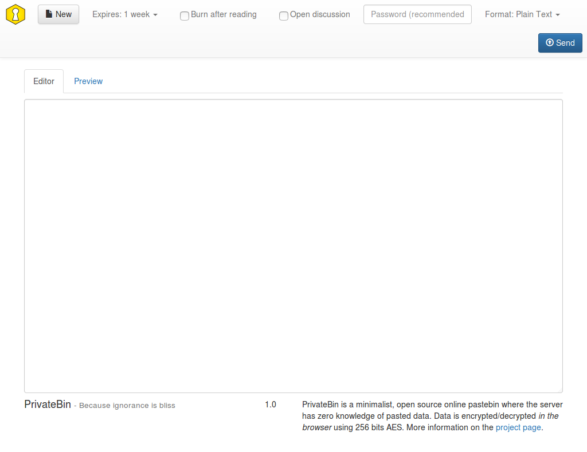

<!--
N.B.: This README was automatically generated by https://github.com/YunoHost/apps/tree/master/tools/README-generator
It shall NOT be edited by hand.
-->

# PrivateBin pour YunoHost

[](https://dash.yunohost.org/appci/app/privatebin)  

[](https://install-app.yunohost.org/?app=privatebin)

*[Read this readme in english.](./README.md)*

> *Ce package vous permet d’installer PrivateBin rapidement et simplement sur un serveur YunoHost.
Si vous n’avez pas YunoHost, regardez [ici](https://yunohost.org/#/install) pour savoir comment l’installer et en profiter.*

## Vue d’ensemble

Pastebin minimaliste où le serveur n'a aucune connaissance des données copiées. Les données sont chiffrées et déchiffrées dans le navigateur en utilisant la technologie AES 256bits en mode Galois Counter (GCM).


**Version incluse :** 1.6.2~ynh2

**Démo :** https://privatebin.net/

## Captures d’écran



## Documentations et ressources

* Site officiel de l’app : <https://privatebin.info/>
* Documentation officielle de l’admin : <https://github.com/PrivateBin/PrivateBin/wiki>
* Dépôt de code officiel de l’app : <https://github.com/PrivateBin/PrivateBin>
* YunoHost Store: <https://apps.yunohost.org/app/privatebin>
* Signaler un bug : <https://github.com/YunoHost-Apps/privatebin_ynh/issues>

## Informations pour les développeurs

Merci de faire vos pull request sur la [branche testing](https://github.com/YunoHost-Apps/privatebin_ynh/tree/testing).

Pour essayer la branche testing, procédez comme suit.

``` bash
sudo yunohost app install https://github.com/YunoHost-Apps/privatebin_ynh/tree/testing --debug
ou
sudo yunohost app upgrade privatebin -u https://github.com/YunoHost-Apps/privatebin_ynh/tree/testing --debug
```

**Plus d’infos sur le packaging d’applications :** <https://yunohost.org/packaging_apps>